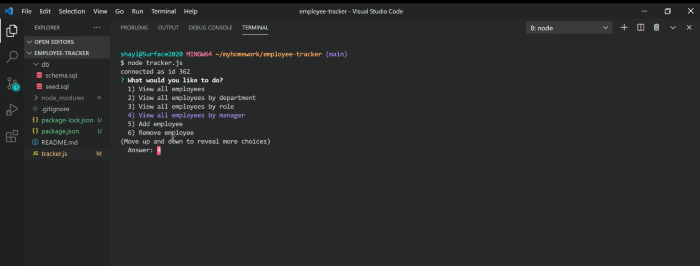

# Employee Tracker

Employee Tracker is a workplace tool used to organize and track personnel. From the command line, interact with your MySql database through use of Inquirer prompts. The application can easily be developed further to add options necessary for your organization.

## Table of Contents
[Features](#Features)

[Installation](#Installation)

[Usage](#Usage)

[Demo](#Demo)

[Questions](#Questions)

[License](#License)

## Features
##### Required Options:
* Add departments, roles, employees
* View departments, roles, employees
* Update employee roles

##### Completed Bonus Options
* Update employee's manager
* View employees by manager
* Delete employee

##### Bonus, Bonus Options
* View all employees by department
* View all employees by role

## Installation
* Run npm install to get all dependencies
* Run schema.sql in MySql workbench
* seed.sql provided to run in mysql workbench if desired

## Usage
* Run node tracker.js to start the program
* Follow prompts
* Exit connection with last option on the main menu

## Demo
To view a video walkthrough, play:

## Questions
Don't hesitate to reach out 
  * Github Username: ShaylaStevenson
  * [View Github Profile](https://github.com/ShaylaStevenson)
  * [View Project Repository](https://github.com/ShaylaStevenson/employee-tracker)
  * Email: shayla.rose.stevenson@gmail.com

  ## License
This project is licensed under the terms of the MIT license. View license at:
https://opensource.org/licenses/MIT.
  